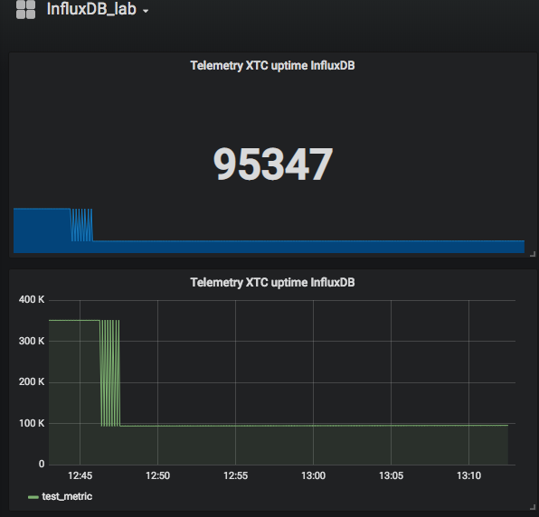

#Telemetry Influxdb lab

    Telemetry recevier got data and stored in tmp file.
    
    influxdb insertion code read the tmp file data by 10 seconds interval and insert into influxdb
    
    Grafana data setup data source from influxdb.
    
    If hate to store data in tmp file ,just make a buffer queue in memory and operate queue FIFO. 
    be aware of queue length limitation  and queue overflow handler.
    
