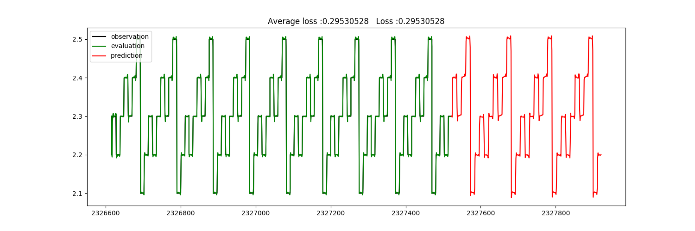
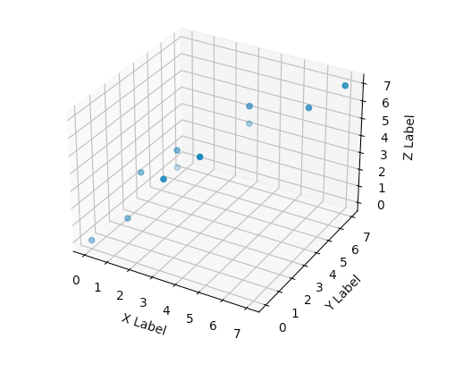
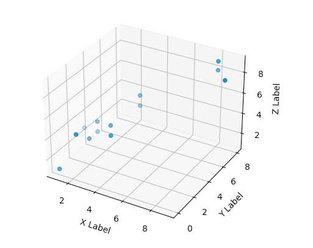
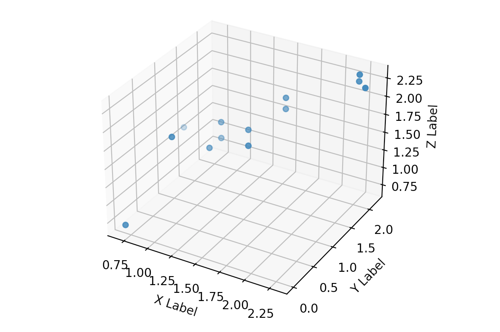
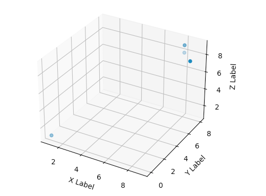
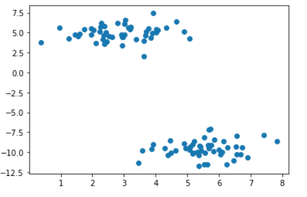
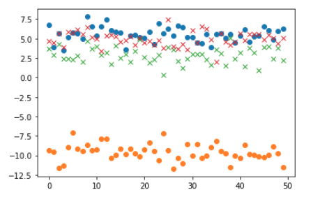

### Telemetry ML Engine Sample Code

#### LSTM prediction machine learning sample code    
    Sample code to predict telemetry data nonlinear trend with tensorflow LSTM RNN

    Class predictor and function predictor_LSTM , input time series source data ,
    result  return evaluated observed and prdicted value and all times ,

    Demo code for predictor deep learning engine with LSTM RNN 
    
#### Telemetry Traffic / Payload Collection and LSTM Prediction sample 

#### Multivariate Gaussian Distribution Abnormal Detection sample code

    Abnormal Detection with multivariate gaussian distribution model, 
    a possibility p(x_input) function get the data set x_input's possibility epsilon density value,
    small density means far away from distribution center.

    A training data set with marked abnormal for a best epsilon density value

    Compare input data set density value p(x) with training data set density value  best_epsilon(x_training),
    if p(x_input) < best_epsilon(x_training), means data seems far away from gaussian distribution center , 
    and got the abnormal from input data set
    
    Output sample:
    
    Training Mean value : array([1.21024119, 1.33255686, 1.43944795])
    Training Variance : array([0.33484255, 0.33258626, 0.34017886])
    Training possible density value : array([5.21959803e-02, 2.93687874e-01, 2.49966588e-02, 2.00708430e-01,
       3.05556827e-01, 2.97216407e-01, 1.28454266e-01, 1.56045536e-01,
       3.17492991e-01, 5.66458355e-02, 1.20683625e-04])
    Input data Possible Density value array([0.20070843, 0.30555683, 0.29721641, 0.12845427, 0.15604554,
       0.31749299, 0.21697702, 0.01064339, 0.20070843, 0.0102079 ,
       0.29368787, 0.30882676, 0.00848956, 0.20070843, 0.30882676,
       0.0066866 ])/
    Best Epsilon Density :0.05693032657265138
    Abnormal Position : array([ 7,  9, 12, 15])

##### Training data set

    Marked training data set with marked y value , to calculate possibility p(Xval) and compare with Yval to select best epsilon
    Yval 0 means normal , 1 means abnormal
    
    Xval_list = [[1,1,1],[2,2,3],[7,7,7],[1,2,3],[2,3,4],[3,3,4],[4,5,6],[4,5,5],[2,3,3],[6,6,6],[0,0,0]]
    Yval_list = [[1],[0],[1],[0],[0],[0,],[0],[0],[0],[1],[1]]
    

##### input data set

    X_list = [[1,2,3],[2,3,4],[3,3,4],[4,5,6],[4,5,5],[2,3,3],[1,3,3],[8,8,8],[1,2,3],[9,7,8],
              [2,2,3],[3,3,3],[8.1,7.8,9],[1,2,3],[3,3,3],[1,0,1]]
    

##### input data set after convert to gaussian distribution with log(x+1)

##### abnormal data set
    
    X_list = [[1,2,3],[2,3,4],[3,3,4],[4,5,6],[4,5,5],[2,3,3],[1,3,3],[8,8,8],[1,2,3],[9,7,8],
                                                                        #7              #9
             [2,2,3],[3,3,3],[8.1,7.8,9],[1,2,3],[3,3,3],[1,0,1]]
                                 #12                        #15
                                 
    Abnormal Position : array([ 7,  9, 12, 15])
                                                                                            

#### Affinity Propagation Cluster

    Non supvervised learning , auto clustering training data sets, and labeld with cluster ID.
    Use affinity propagration to clustering dataset in an EU space with instance to center
    labels count is unpredictable , should based on data set samples.
    Note, EU space is multi dimension space , in this case, 100X100 3D

##### generate sample dataset
    
    x, _ = datasets.make_blobs(n_samples=100, centers=2,n_features=2, random_state=10)
    #centers means in 2D how many clusters will be generated, features means 2D
    

##### Labeled test dataset, clustering to find abnormal data or root cause.

