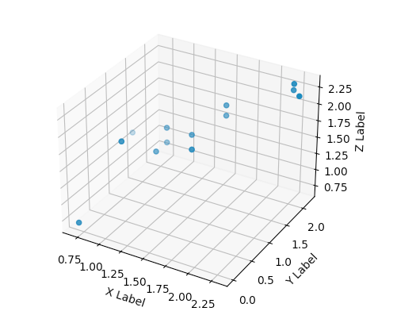

### Telemetry ML Engine Sample Code

#### LSTM prediction machine learning sample code    
    Sample code to predict telemetry data nonlinear trend with tensorflow LSTM RNN

    Class predictor and function predictor_LSTM , input time series source data ,
    result  return evaluated observed and prdicted value and all times ,

    Demo code for predictor deep learning engine with LSTM RNN 
    
#### Telemetry Traffic / Payload Collection and LSTM Prediction sample 

#### Multivariate Gaussian Distribution Abnormal Detection sample code

    Abnormal Detection with multivariate gaussian distribution model, 
    a possibility p(x_input) function get the data set x_input's possibility epsilon density value,
    small density means far away from distribution center.

    A training data set with marked abnormal for a best epsilon density value

    Compare input data set density value p(x) with training data set density value  best_epsilon(x_training),
    if p(x_input) < best_epsilon(x_training), means data seems far away from gaussian distribution center , 
    and got the abnormal from input data set
    
    Output sample:
    
    Mean value : array([1.30296349, 1.42169701, 1.58981761]) # after convert to gaussian distribute data set
    Variance : array([0.30074233, 0.27008326, 0.15935424])   # after convert to gaussian distribute data set
    Possible Density value array([0.21768332, 0.51882173, 0.54973851, 0.24887983, 0.32599314,
       0.45614046, 0.26347663, 0.01523976, 0.21768332, 0.01494961,
       0.37686139, 0.48332204, 0.01015546, 0.21768332, 0.48332204,
       0.00057216])/
    Best Epsilon Density :0.11379609604031615
    Abnormal Position : array([ 7,  9, 12, 15])

##### Training data set

    Marked training data set with marked y value , to calculate possibility p(Xval) and compare with Yval to select best epsilon
    Yval 0 means normal , 1 means abnormal
    
    Xval_list = [[1,1,1],[2,2,3],[7,7,7],[1,2,3],[2,3,4],[3,3,4],[4,5,6],[4,5,5],[2,3,3],[6,6,6],[0,0,0]]
    Yval_list = [[1],[0],[1],[0],[0],[0,],[0],[0],[0],[1],[1]]
    

##### input data set

    X_list = [[1,2,3],[2,3,4],[3,3,4],[4,5,6],[4,5,5],[2,3,3],[1,3,3],[8,8,8],[1,2,3],[9,7,8],
              [2,2,3],[3,3,3],[8.1,7.8,9],[1,2,3],[3,3,3],[1,0,1]]
    

##### input data set after convert to gaussian distribution with log(x+1)

##### abnormal data set
    
    X_list = [[1,2,3],[2,3,4],[3,3,4],[4,5,6],[4,5,5],[2,3,3],[1,3,3],[8,8,8],[1,2,3],[9,7,8],
                                                                        #7              #9
             [2,2,3],[3,3,3],[8.1,7.8,9],[1,2,3],[3,3,3],[1,0,1]]
                                 #12                        #15
                                 
    Abnormal Position : array([ 7,  9, 12, 15])
                                                                                            

