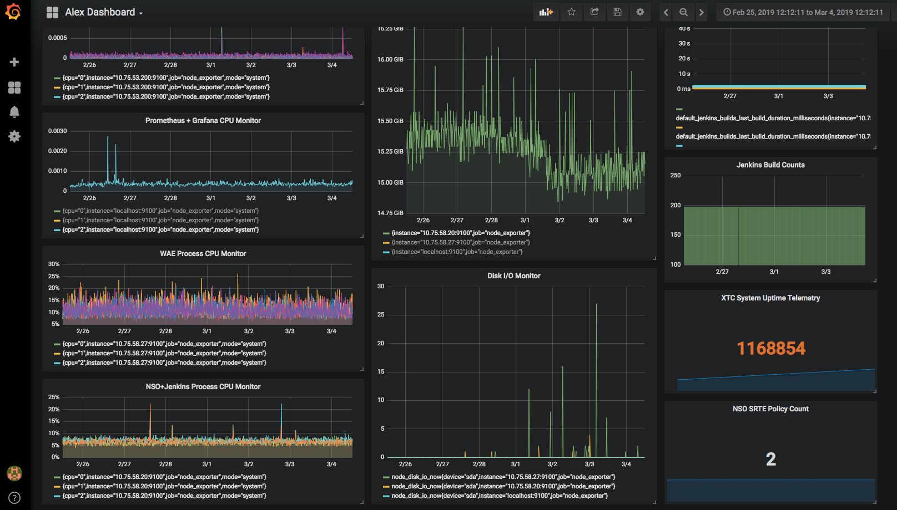
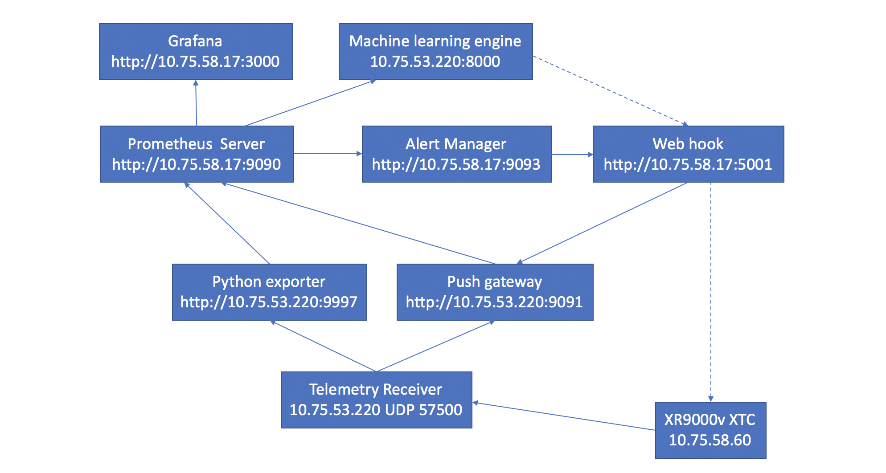

##Telemetry receiver and prometheus lab

    Telemetry receiver gather source informatin from telemetry source devices, 
    and export to prometheus server via exporter or push gateway.
    
    Grafana shows the data graphic.
    
    Prometheus alert manager triggered by metric values and invoke webhook to triger actions. 
    
    Prometheus REST like API provides query service via promQL.
    
 
 
 ##Test bed 
 
 
 
 ##Machine learning engie 
 
     Test code with Tensorflow LSTM , time series training data pulled from prometheus server , 
     then produce predicted data graph.